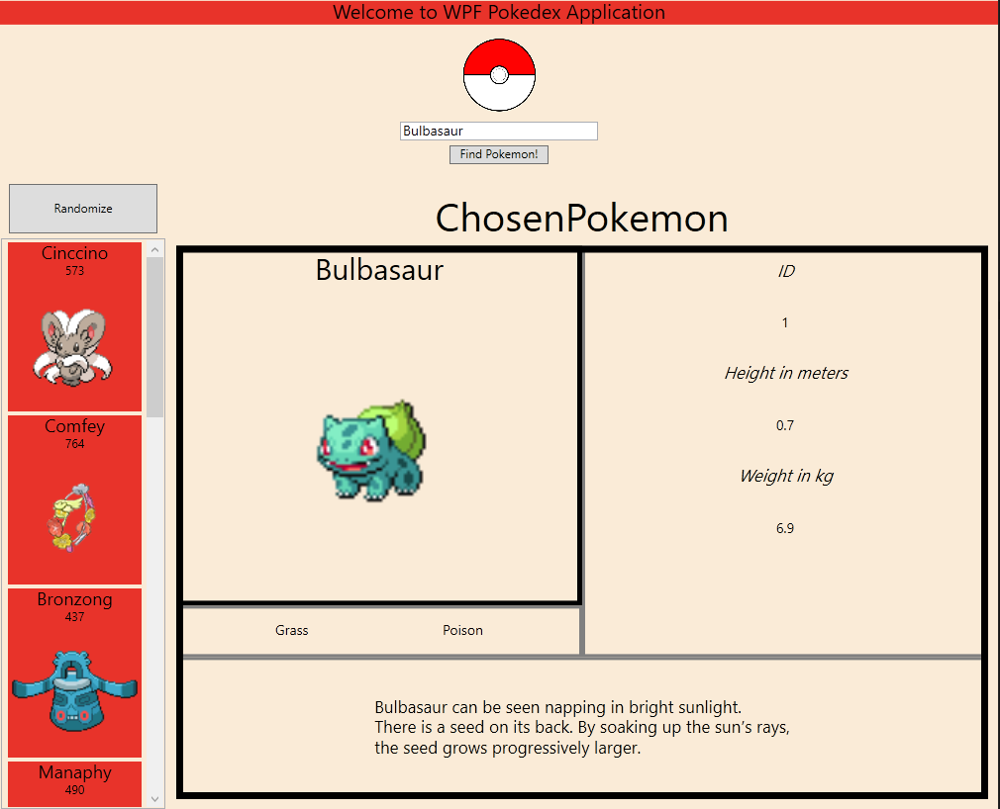

# WpfProject

## Description
This is a Pokedex project made by Artemii Lazovskii and Daniel Marin as a part of our engeneering course.

It has as a purpose to demonstrate our knowledge of C#, WPF, and MVVM.

## Requirements
We've used Rider IDE for the project, so you better use it too (to avoid any possibel conflicts).

Install JSON.Net (preferably with NuGet)

Instruction: `https://www.newtonsoft.com/json`

Install WebApi client for .NET

Instructions: `https://www.nuget.org/packages/Microsoft.AspNet.WebApi.Client/`

Install Nunit for testing

Instructions: `https://www.nuget.org/packages/Nunit`
